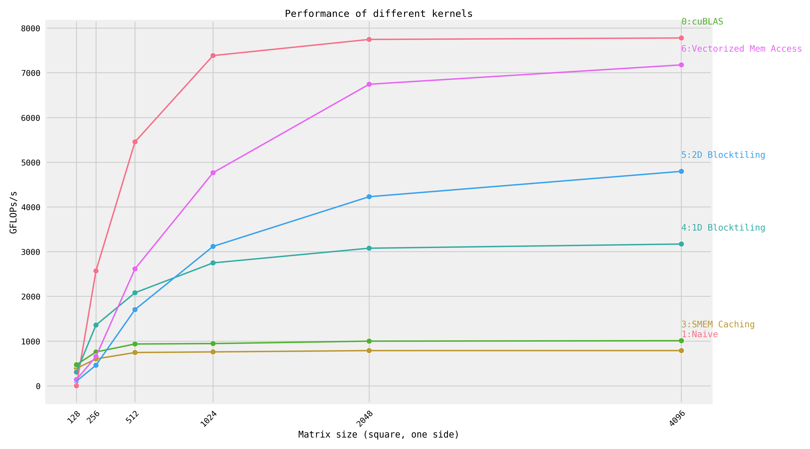

# Fast CUDA SGEMM from Scratch

Step-by-step optimization of matrix multiplication, implemented in CUDA.
For an explanation of each kernel, see [siboehm.com/CUDA-MMM](https://siboehm.com/articles/22/CUDA-MMM).

## Overview

Running the kernels on a NVIDIA 3060 (Ampere):



GFLOPs at matrix size 4096x4096:
<!-- benchmark_results -->
| Kernel                   |   GFLOPs/s | Performance relative to cuBLAS   |
|:-------------------------|-----------:|:---------------------------------|
| 1: Naive                 |      789.6 | 10.2%                            |
| 2: GMEM Coalescing       |      792.3 | 10.2%                            |
| 3: SMEM Caching          |     1010.4 | 13.0%                            |
| 4: 1D Blocktiling        |     3171.9 | 40.8%                            |
| 5: 2D Blocktiling        |     4796.9 | 61.7%                            |
| 6: Vectorized Mem Access |     7177.3 | 92.3%                            |
| 0: cuBLAS                |     7779   | 100.0%                           |
<!-- benchmark_results -->

## Setup

1. Install dependencies: CUDA toolkit 12, Python (+ Seaborn), CMake, Ninja. See [environment.yml](environment.yml).
1. Configure NVCC compilation parameters. Look up your GPUs compute
   capability [here](https://developer.nvidia.com/cuda-gpus). Then configure the `CMakeLists.txt` and change:
    ```cmake
    set(CUDA_COMPUTE_CAPABILITY 80)
    ```
1. Build: `mkdir build && cd build && cmake .. && cmake --build .`
1. Run one of the kernels: `DEVICE=<device_id> ./sgemm <kernel number>`
1. Profiling via [NVIDIA Nsight Compute](https://developer.nvidia.com/nsight-compute) (ncu): `make profile KERNEL=<kernel number>`

Credit goes to [siboehm/SGEMM_CUDA](https://github.com/siboehm/SGEMM_CUDA) for the template and [great explanations](https://siboehm.com/articles/22/CUDA-MMM).
